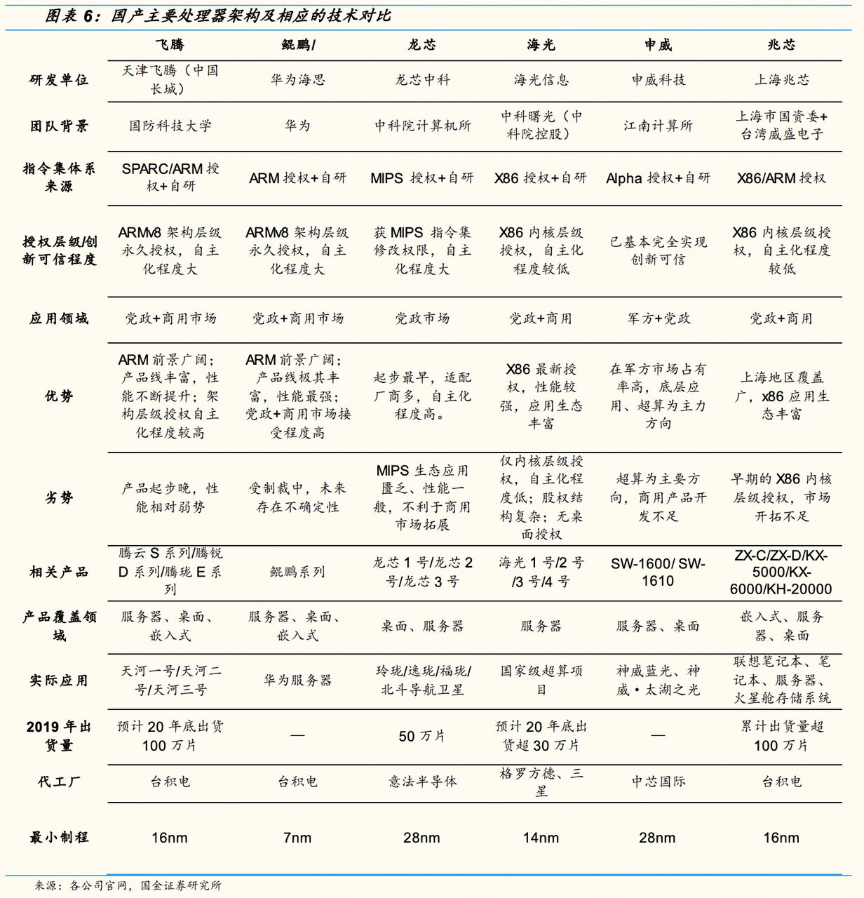
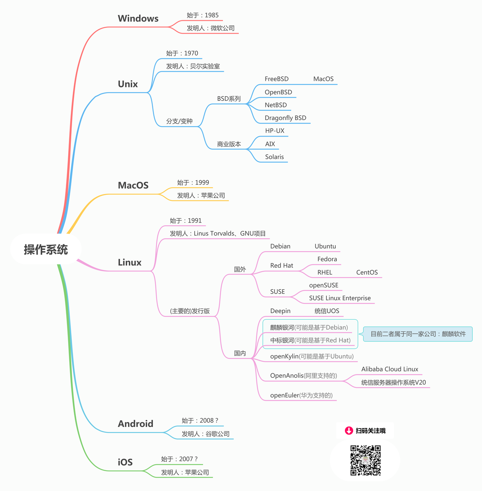

## **1、国产替代概览**

| 考量因素 | 替代方案                                                                                                                     |
| -------- | ---------------------------------------------------------------------------------------------------------------------------- |
| CPU      | x86：海光、兆芯 ``ARM：鲲鹏、飞腾``自研指令集：龙芯、申威                                                                    |
| 操作系统 | 开源：openEuler（欧拉）、Anolis（龙蜥）``商业版本：银河麒麟（基于openEuler，收费）、统信UOS（基于Anolis、openEuler、Debian） |
| 数据库   | 华为GaussDB、阿里OceanBase、达梦、人大金仓、南大通用、神州通用等                                                             |
| 中间件   | 国产替代：东方通系、宝兰德系、中创``模糊（有些公司反馈说给钱也符合信创标准）：Redis 、Kafka 、Nginx、Tomcat                  |

## **2、国内主要处理器架构和相应技术对比（图片来源于网络）**

## 3、**国产操作系统** & **版本区分说明**（24年9月更新）

**麒麟系列：**

1. **银河麒麟** ：2004年，由国防科技大学主导推出，早期基于FreeBSD，后来转向Linux内核。
2. **中标麒麟** ：2010年，银河麒麟和中标Linux合并，开发中标麒麟操作系统。
3. **天津麒麟** ：2014年，天津麒麟成立，国防科技大学将「麒麟」、「银河麒麟」、「KYLIN」等商标及相关知识产权授予了天津麒麟。
4. **麒麟软件** ：2019年，天津麒麟和中标麒麟合并，成立麒麟软件（KylinSoft）有限公司，共同维护开发银河麒麟、中标麒麟两个操作系统。
5. **优麒麟(Ubuntu Kylin)** ：2013年创立，是工信部、国防科技大学和Ubuntu系统开发商Canonical合作的产物，可以看做是Ubuntu系统的中文定制发行版。
6. **开放麒麟(openKylin)** ：麒麟操作系统的社区开源版，在2023年7月份发布openKylin 1.0的时候，官方的说法是「我国首个开源计算机桌面操作系统」，它带的是有Ubuntu标记的GCC 9.3。

**Deepin系列：**

7. **Deepin** ：武汉深之度开发，如果从最早的Hiwix版本算起，已经有接近20年的历史了。Deepin是国内Linux爱好者们最喜欢的中国发行版。最早基于Ubuntu，后来转向基于Debian，2022年宣布脱离Debian，构建自己的根社区。根据Deepini官方的说法，Deepin操作系统持续更新超过200次，全球下载超过8000万，海外用户超过300万，并基于Deepin衍生出UbuntuDDE、Manjaro deepin等多个发行版本。
8. **统信UOS** ：是2019年由中国电子集团、武汉深之度等共同打造的Linux的操作系统，可以认为是Deepin的下游发行版。

**OpenAnolis（龙蜥）**

OpenAnolis是由阿里公司赞助的开源Linux发行版，是以云端场景为主的服务器操作系统，100%兼容CentOS 8软件生态。具有广泛的CPU支持，包括中国自制芯片。同时提供CentOS系统到Anolis OS迁移工具。自CentOS 8在2021年底停止服务之后，包括阿里在内的多家企业，转向使用OpenAnolis，据称，到2022年5月24日，整体装机量已达130多万

**openEuler（欧拉）**

华为最早在2010年开始推出EulerOS操作系统，到了2019年，华为创建openEuler开源社区，并将EulerOS相关的能力贡献到openEuler社区，2021年，推出openEuler操作系统，这是一个面向服务器的Linux发行版。openEuler同样支持包括国产芯片在内的多种CPU。作为服务器操作系统，根据赛迪《中国服务器操作系统市场研究报告》，2021年在政府行业，以及民生相关的运营商行业、金融、能源等行业，openEuler的装机量都位居前两名，例如政府行业装机量中，openEuler占比35.2%，位居第一。

**最后**

整体来说，目前国产Linux操作系统目前处于「可用」状态（非「好用」），这些操作系统有别于国外发行版的核心特点是对国产CPU（海思、飞腾、兆芯、龙芯、海光及申威等）的支持和优化、安全性增强(毕竟信创的背景之一就是「棱镜门」事件)、对国内常用软件的优化支持等。虽然在个人用户中普及率还很低，但在党政机关和8大民生行业（金融、电信、石油、电力、交通、航空航天、医院、教育）中，已经有比较高的普及率，尤其在党政核心部门，基本上已经100%换装国产Linux操作系统；在服务器操作系统市场，国产Linux操作系统市场份额上升显著，尤其在党政机关和重点民生行业，预计市占率超过20%。

